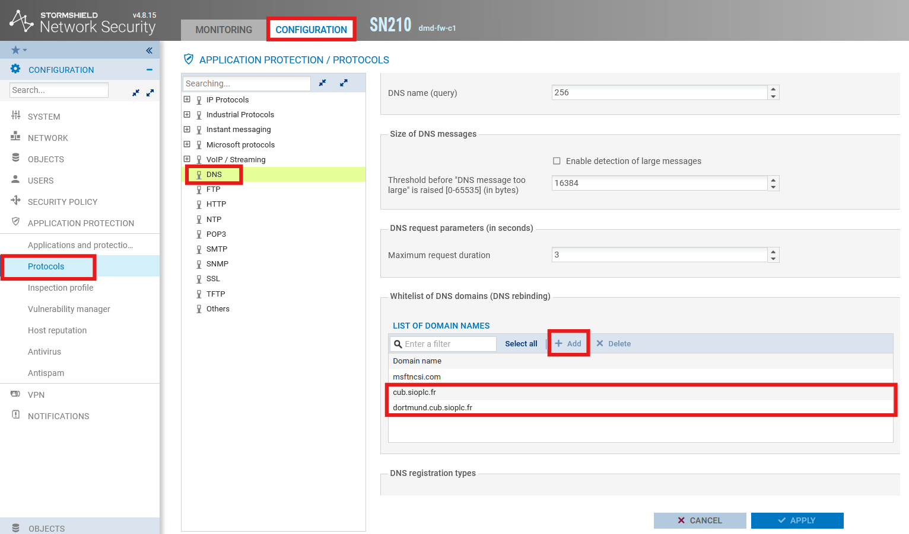

# Autorisation de la zone DNS sur StormShield

---

## Informations

- **Auteur :** Louis MEDO
- **Date :** 08/10/2026
- **Domaine :** Exploitation services

---

## 1. Sommaire

- [2. Contexte](#2-contexte)
- [3. Procédure d'autorisation DNS](#3-procedure-dautorisation-dns)

## 2. Contexte

Cette procédure documente l'autorisation de la résolution DNS pour les domaines spécifiques de l'infrastructure étudiante (`cub.sioplc.fr` et `dortmund.cub.sioplc.fr`) sur le pare-feu StormShield. Cette modification assure que les requêtes légitimes vers ces zones ne sont pas bloquées par la protection applicative.

## 3. Procedure d'autorisation DNS {#3-procedure-dautorisation-dns}

3.1. **Connexion au portail d'administration.** Se connecter à l'interface web de gestion du boîtier StormShield.

> [!info] Authentification
> Utiliser les mots de passe d'administration centralisés, disponibles dans le gestionnaire de mots de passe Bitwarden.

3.2. **Mise à jour de la liste blanche DNS.** Naviguer dans les paramètres de protection applicative pour ajouter les noms de domaine autorisés. 

Rendez-vous dans `Configuration > Application protection > Protocols > DNS` et rentrez les informations suivantes :

- `cub.sioplc.fr`
- `dortmund.cub.sioplc.fr`

