# Installation d'un serveur Active directory


---

## Informations

- **Auteur :** Louis MEDO
- **Date :** 26/09/2026
- **Domaine :** Administration Windows

---

## 1. Sommaire

1. Sommaire
2. Contexte
3. Prérequis et Bonnes Pratiques
4. Installation du rôle AD DS via le Gestionnaire de Serveur
5. Promotion du serveur en Contrôleur de Domaine (GUI)
6. Installation et Promotion sur Windows Server Core (CLI)

## 2. Contexte

Ce document décrit la procédure de déploiement et de promotion d'un serveur Windows en tant que Contrôleur de Domaine (DC) hébergeant les rôles Active Directory Domain Services (AD DS) et DNS. Cette mise en production permet de centraliser la gestion des identités, l'authentification des utilisateurs, et l'application des stratégies de groupe (GPO) au sein de l'infrastructure. L'approche inclut à la fois l'installation classique via interface graphique et une méthode en ligne de commande pour les environnements de type Server Core.

## 3. Prérequis et Bonnes Pratiques

### 3.1. Prérequis d'infrastructure réseau

Avant toute installation du rôle AD DS, il est impératif de configurer correctement la couche réseau du serveur :

- **Nommage :** Le serveur doit être renommé conformément aux règles de nommage.
- **IP Statique :** Le serveur doit posséder une adresse IPv4/IPv6 fixe.
- **Configuration DNS :** Le serveur DNS de la carte réseau du contrôleur de domaine doit pointer vers lui-même (ex : `127.0.0.1`).

### 3.2. Bonnes pratiques Active Directory

- **Désactivation de la récursivité DNS :** Afin d'éviter les attaques par amplification ou empoisonnement du cache, il est crucial de désactiver la récursivité sur le serveur DNS si celui-ci n'est pas destiné à résoudre des noms externes pour les clients.
- **Séparation des rôles :** Ne pas héberger d'applications métier (IIS, SQL) ou de rôles de fichiers lourds sur un contrôleur de domaine.
- **Stockage :** Il est recommandé de placer la base de données NTDS (`NTDS.DIT`) et les journaux SYSVOL sur une partition isolée du système d'exploitation.

## 4. Installation du rôle AD DS via le Gestionnaire de Serveur

4.1. **Lancement de l'assistant d'ajout de rôles.** Aller dans le Gestionnaire de serveur. Puis cliquer sur Gérer. Enfin, aller sur Ajouter des rôles et fonctionnalités.

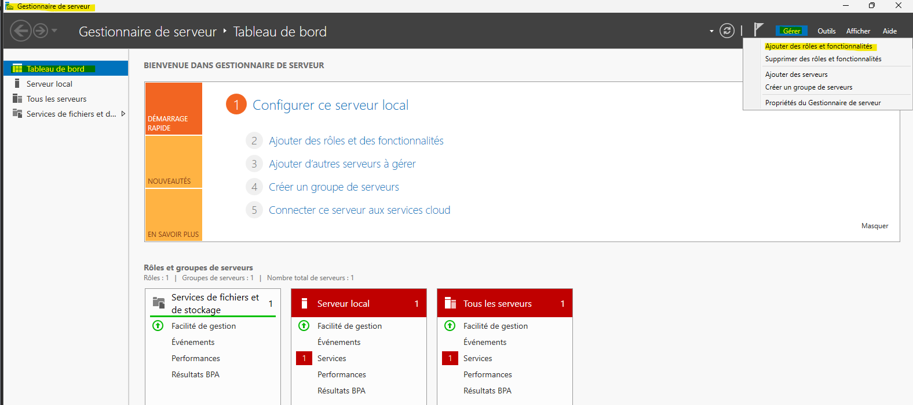

4.2. **Validation des prérequis de l'assistant.** Cliquer sur Suivant.

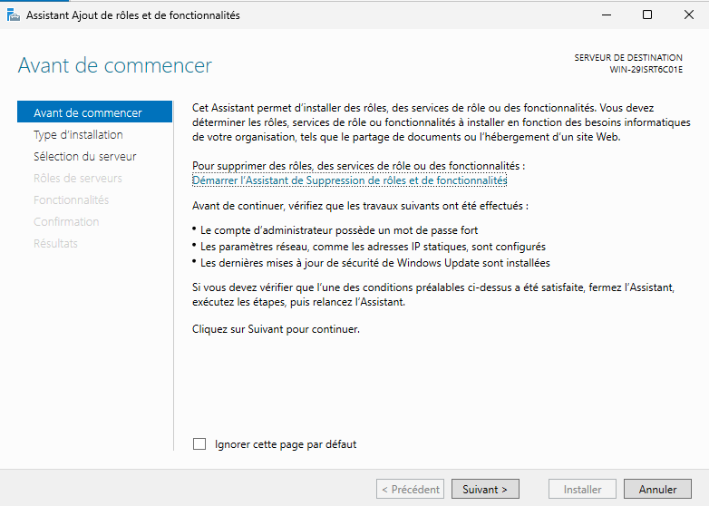

4.3. **Sélection du type d'installation.** Choisir Installation basée sur un rôle ou une fonctionnalité et faire suivant.

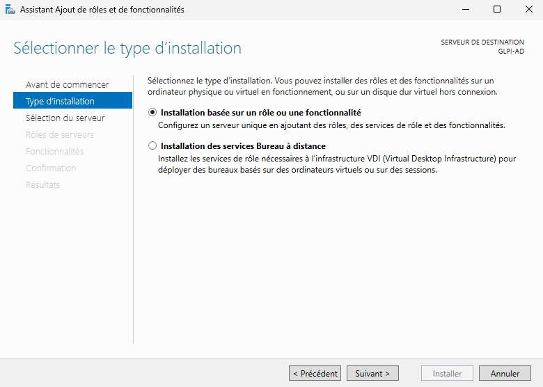

4.4. **Sélection du serveur de destination.** Sélectionner votre serveur dans le pool de serveurs.

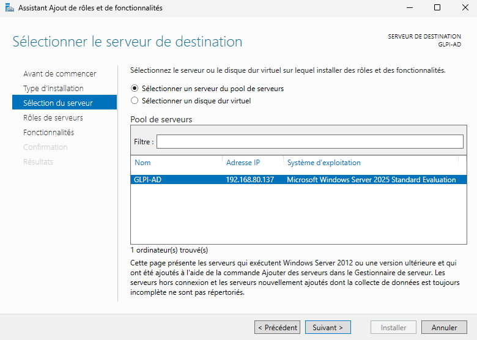

4.5. **Sélection des rôles de serveurs.** Cocher service de domaine Active Directory. Valider l'ajout des fonctionnalités requises si une fenêtre supplémentaire s'ouvre.

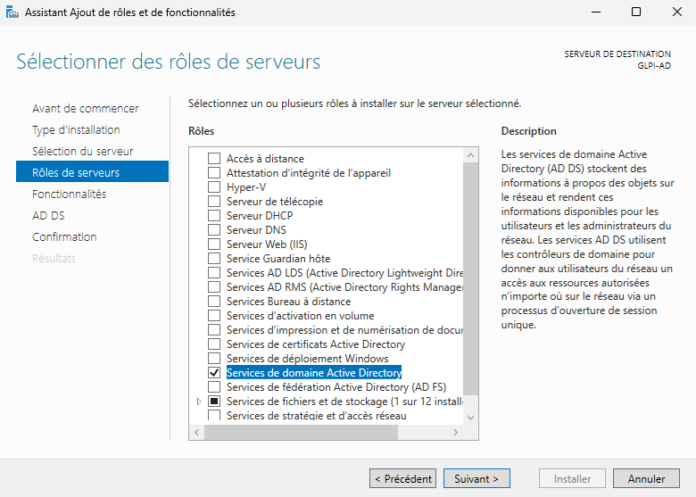

4.6. **Sélection des fonctionnalités.** Laisser les choix par défaut et faire suivant.

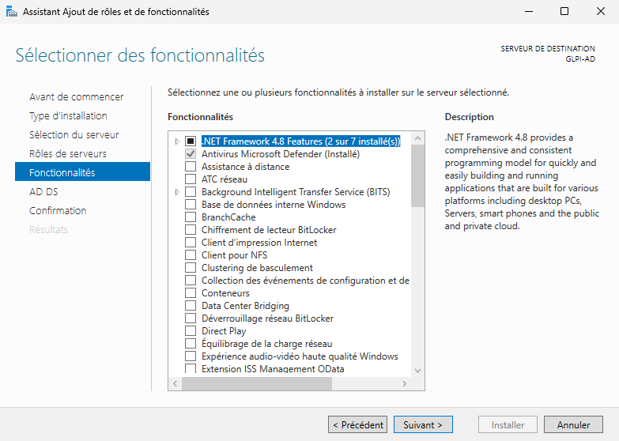

4.7. **Informations sur le rôle AD DS.** Lire les recommandations et faire suivant.

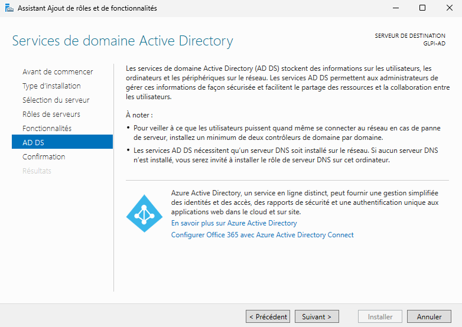

4.8. **Confirmation de l'installation.** Vérifier les éléments qui vont être installés et cliquer sur installer.

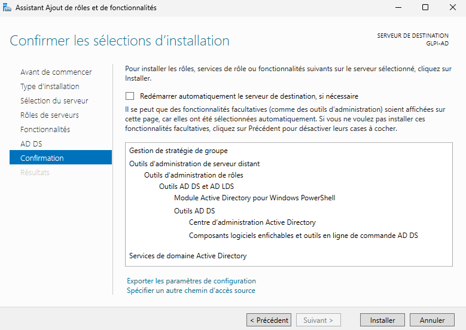

## 5. Promotion du serveur en Contrôleur de Domaine (GUI)

5.1. **Déclenchement de la promotion.** Une fois les binaires installés, il faut promouvoir votre serveur en tant que contrôleur de domaine. Retourner sur Gestionnaire de serveur, cliquer sur le drapeau d'alerte et sélectionner "Promouvoir ce serveur en contrôleur de domaine".

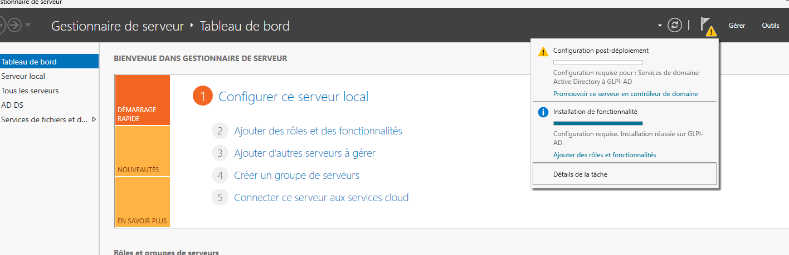

5.2. **Configuration du déploiement.** Sélectionner "Ajouter une nouvelle forêt" et choisir le nom de domaine racine de votre contrôleur active directory (par exemple `DOMAIN.LAN`).

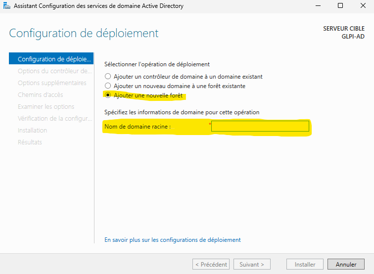

5.3. **Options du contrôleur de domaine.** Rentrer un mot de passe robuste pour le mode de restauration des services d'annuaire (DSRM).

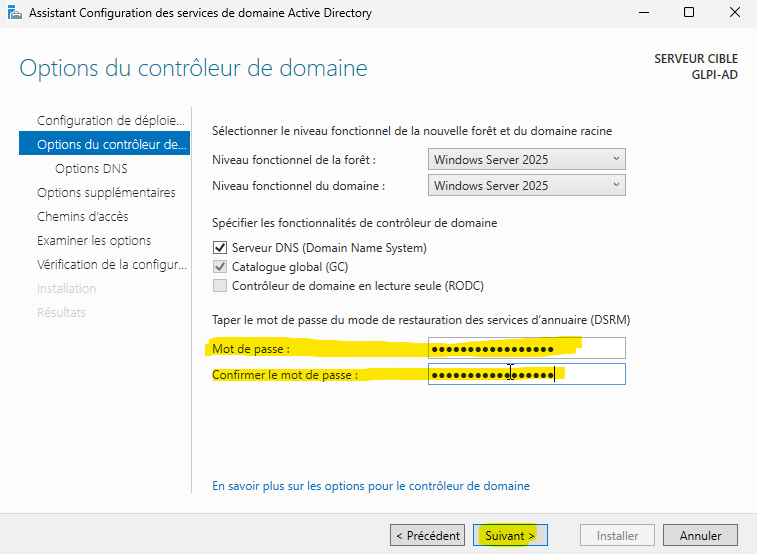

5.4. **Options DNS.**

> [!info] Avertissement de délégation DNS
> Un message d'avertissement jaune apparaît souvent indiquant qu'une délégation DNS ne peut pas être créée. C'est un comportement parfaitement normal lors de la création de la première forêt, car la zone parente autoritaire n'existe pas encore ou n'est pas joignable. Le processus va installer et configurer automatiquement la zone DNS locale.

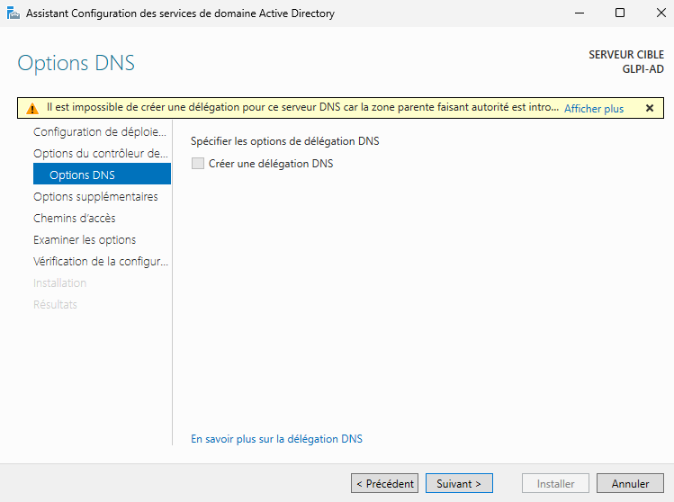

5.5. **Options supplémentaires (NetBIOS).** Laisser par défaut le nom NetBIOS généré et faire suivant.

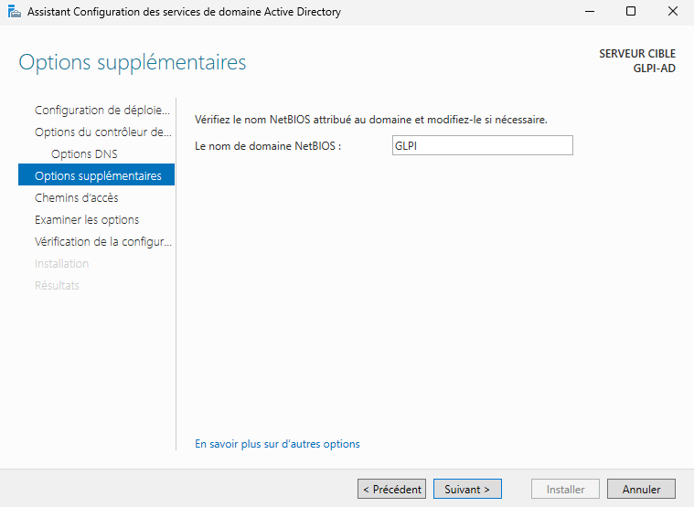

5.6. **Chemins d'accès (NTDS et SYSVOL).** Laisser par défaut ou modifier les chemins si vous respectez la bonne pratique de séparation sur un autre volume, et faire suivant.

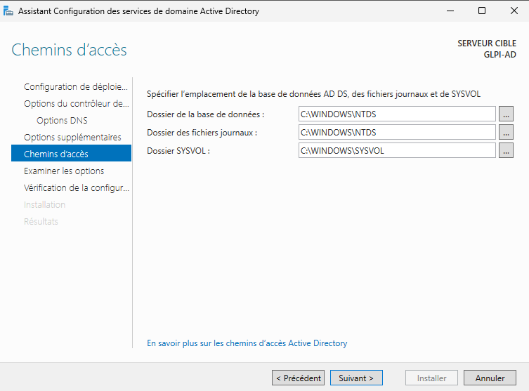

5.7. **Examiner les options.** Vérifier le résumé des informations saisies et faire suivant. (Il est possible d'exporter le script PowerShell à cette étape).

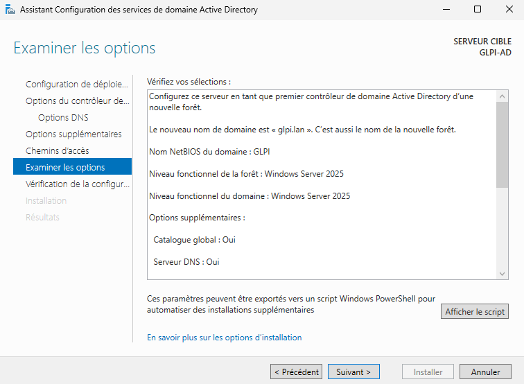

5.8. **Vérification de la configuration requise et lancement.** Vous pouvez maintenant cliquer sur installer pour terminer la promotion du serveur en tant que contrôleur de domaine. Le serveur redémarrera automatiquement.

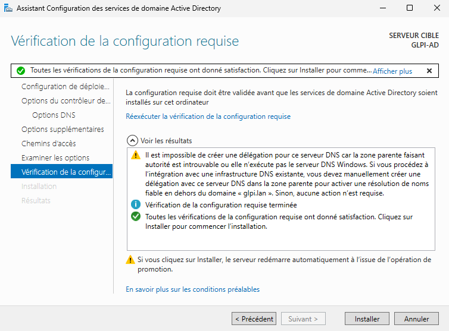

## 6. Installation de Active Directory sur Windows Server Core (CLI)

6.1. **Configuration du nom, de l'IP statique et du DNS local.** Adapter les interfaces et adresses selon votre plan d'adressage.

```powershell
# Renommer le serveur et redémarrer (exécuter le script suivant après redémarrage)
Rename-Computer -NewName "AD01" -Restart

# Configurer l'IP statique sur l'interface principale
New-NetIPAddress -InterfaceAlias "Ethernet" -IPAddress 192.168.1.10 -PrefixLength 24 -DefaultGateway 192.168.1.254

# Configurer le DNS pour qu'il pointe vers lui-même (loopback IPv4)
Set-DnsClientServerAddress -InterfaceAlias "Ethernet" -ServerAddresses ("127.0.0.1")
```

* `Rename-Computer` : Modifie le nom d'hôte de la machine.
* `-NewName` : Spécifie le nouveau nom à attribuer.
* `-Restart` : Force le redémarrage immédiat pour appliquer le nom.
* `New-NetIPAddress` : Configure une nouvelle adresse IP sur l'interface ciblée.
* `-InterfaceAlias` : Indique le nom de la carte réseau (ici "Ethernet").
* `-IPAddress` : Assigne l'adresse IPv4/IPv6 statique.
* `-PrefixLength` : Définit le masque de sous-réseau (ex: 24 correspond à 255.255.255.0).
* `-DefaultGateway` : Définit la passerelle par défaut.
* `Set-DnsClientServerAddress` : Modifie les serveurs DNS de la carte réseau.
* `-ServerAddresses` : Spécifie les IP des serveurs DNS (ici 127.0.0.1 pour la boucle locale).

6.2. **Installation des binaires du rôle AD DS et des outils de gestion.**

```powershell
Install-WindowsFeature -Name AD-Domain-Services -IncludeManagementTools
```

* `Install-WindowsFeature` : Commande permettant d'installer un rôle ou une fonctionnalité de Windows Server.
* `-Name` : Identifiant du rôle à installer (ici les services AD DS).
* `-IncludeManagementTools` : Installe également les consoles de gestion (GUI) et les modules PowerShell associés.

6.3. **Promotion du serveur en contrôleur de domaine (Création d'une forêt).**

```powershell
# Définir le mot de passe de restauration (DSRM) de manière sécurisée
$SecureDSRMPassword = ConvertTo-SecureString "P@ssw0rdDSRM_CUB!" -AsPlainText -Force

# Promouvoir le serveur, installer le DNS et redémarrer automatiquement
Install-ADDSForest `
    -CreateDnsDelegation $false `
    -DatabasePath "C:\Windows\NTDS" `
    -DomainMode "WinThreshold" `
    -DomainName "DOMAIN.LAN" `
    -DomainNetbiosName "DOMAIN" `
    -ForestMode "WinThreshold" `
    -InstallDns $true `
    -LogPath "C:\Windows\NTDS" `
    -NoRebootOnCompletion $false `
    -SysvolPath "C:\Windows\SYSVOL" `
    -Force $true `
    -SafeModeAdministratorPassword $SecureDSRMPassword
```

* `ConvertTo-SecureString` : Convertit le mot de passe en clair vers une chaîne chiffrée sécurisée en mémoire.
* `-AsPlainText` : Indique que la source fournie est en texte brut.
* `-Force` : Force l'exécution de la conversion du texte brut.
* `Install-ADDSForest` : Lance la création d'une nouvelle forêt et promeut le serveur en DC.
* `-CreateDnsDelegation` : Définit s'il faut déléguer la zone DNS parente (faux ici).
* `-DatabasePath`, `-LogPath`, `-SysvolPath` : Définissent les dossiers de stockage pour la base, les logs et le SYSVOL.
* `-DomainMode`, `-ForestMode` : Spécifient le niveau fonctionnel (WinThreshold correspond à Windows Server 2016).
* `-DomainName` : Définit le nom complet (FQDN) du nouveau domaine.
* `-DomainNetbiosName` : Définit le nom NetBIOS (nom court) du domaine.
* `-InstallDns` : Indique si le rôle Serveur DNS doit être installé conjointement.
* `-NoRebootOnCompletion` : Autorise le redémarrage automatique après l'installation si `$false`.
* `-SafeModeAdministratorPassword` : Applique le mot de passe DSRM converti précédemment de façon sécurisée.

6.4. **Désactivation de la récursivité DNS.** Exécuter cette commande post-déploiement pour respecter les contraintes de sécurité.

```powershell
Set-DnsServerRecursion -Enable $false
```

* `Set-DnsServerRecursion` : Permet de configurer l'état de la récursivité du service DNS.
* `-Enable $false` : Désactive la récursivité pour empêcher le serveur de résoudre des requêtes externes non autorisées.
