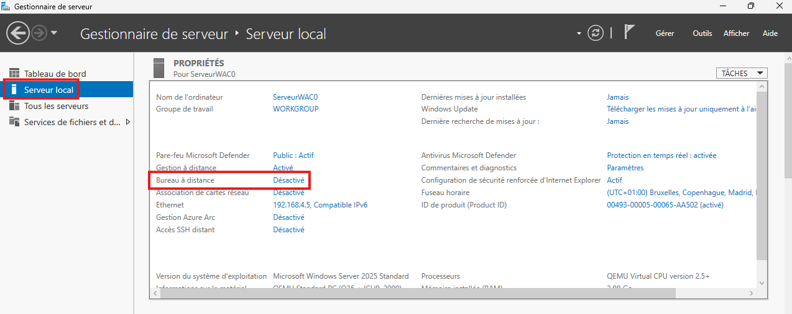
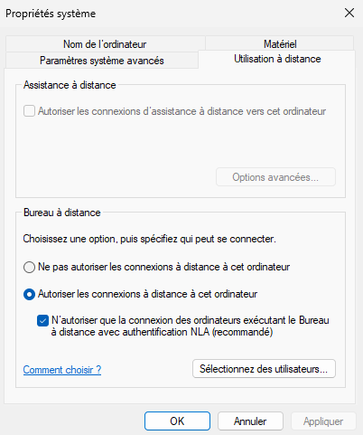

# Activer le bureau à distance


---

## Informations

- **Auteur :** Louis MEDO
- **Date :** 16/09/2026
- **Domaine :** Windows

---

## 1. Sommaire

- [1. Sommaire](#1-sommaire)
- [2. Contexte](#2-contexte)
- [3. Activation via l'interface graphique (GUI)](#3-activation-via-linterface-graphique-gui)
- [4. Activation via PowerShell (IaC)](#4-activation-via-powershell-iac)

## 2. Contexte

L'activation du Bureau à distance (RDP) permet d'administrer les serveurs Windows de manière distante. Ce composant est central pour l'infrastructure CUB, car il autorise la gestion continue des serveurs sans nécessiter d'accès physique. Le service nécessite l'ouverture des flux réseau associés (port TCP 3389).

> [!warning] Sécurité et NLA
> L'ouverture du port RDP expose la machine sur le réseau. Il est impératif de conserver l'authentification NLA (Network Level Authentication) active afin d'exiger une authentification avant même l'établissement complet de la session RDP.

## 3. Activation via l'interface graphique (GUI)

3.1. **Naviguer dans le Gestionnaire de serveur.** Ouvrez le **Gestionnaire de serveur** et cliquez sur le menu **Serveur local** situé dans la colonne de gauche.

3.2. **Ouvrir les propriétés de connexion.** Dans le panneau **PROPRIÉTÉS**, localisez la ligne **Bureau à distance** (indiquée comme "Désactivé") et cliquez sur le lien associé.



3.3. **Autoriser les connexions.** Dans la fenêtre **Propriétés système**, cochez l'option **Autoriser les connexions à distance à cet ordinateur**. Assurez-vous que l'option imposant l'authentification NLA reste cochée, puis cliquez sur **Appliquer** et **OK**.



## 4. Activation via PowerShell (IaC)

4.1. **Exécuter les commandes d'activation RDP.** Lancez une console PowerShell en tant qu'administrateur afin de modifier le registre et ouvrir les ports dans le pare-feu local.

```powershell
Set-ItemProperty -Path 'HKLM:\System\CurrentControlSet\Control\Terminal Server' -Name "fDenyTSConnections" -Value 0
Enable-NetFirewallRule -DisplayGroup "Bureau à distance"
```

- `Set-ItemProperty` : Commande permettant de modifier la valeur ou la propriété d'un élément (ici, une clé de registre).
- `-Path 'HKLM:\...'` : Définit le chemin exact de la clé de registre liée au service Terminal Server.
- `-Name "fDenyTSConnections"` : Cible l'attribut spécifique qui gère l'interdiction (Deny) des connexions RDP.
- `-Value 0` : Assigne la valeur `0` (Faux) pour lever l'interdiction, ce qui active le RDP.
- `Enable-NetFirewallRule` : Commande utilisée pour activer une ou plusieurs règles de pare-feu Windows existantes mais désactivées.
- `-DisplayGroup "Bureau à distance"` : Sélectionne toutes les règles associées au groupe d'affichage "Bureau à distance" pour autoriser le trafic réseau entrant (TCP 3389).
