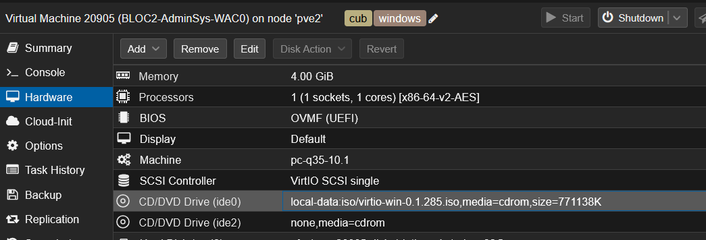
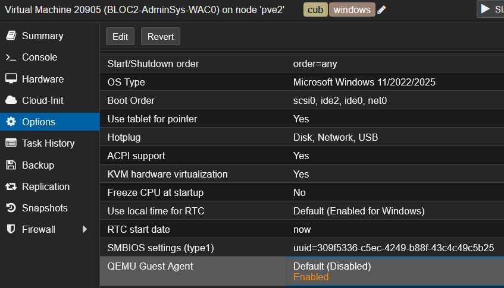
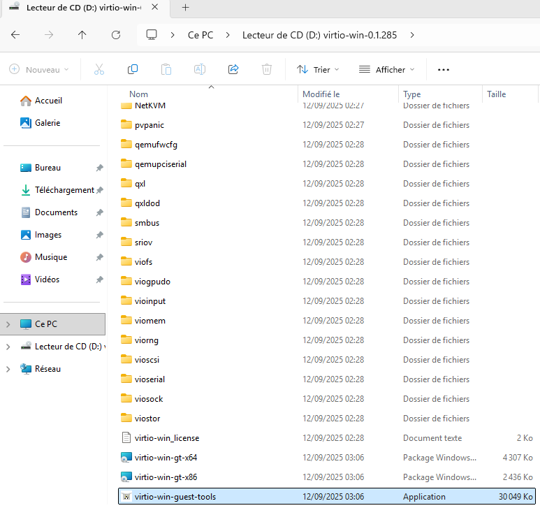

# Déployer l'Agent QEMU Guest sur Windows


---

## Informations

- **Auteur :** Louis MEDO
- **Date :** 16/09/2026
- **Domaine :** Windows

---

## 1. Sommaire

- [1. Sommaire](#1-sommaire)
- [2. Contexte](#2-contexte)
- [3. Activation et installation via l'interface graphique (GUI)](#3-activation-et-installation-via-linterface-graphique-gui)
- [4. Installation silencieuse via PowerShell (CLI)](#4-installation-silencieuse-via-powershell-cli)

## 2. Contexte

L'agent QEMU (QEMU Guest Agent) est un service s'exécutant au sein de la machine virtuelle Windows. Il permet à l'hyperviseur Proxmox de communiquer de manière privilégiée avec l'OS invité. Au sein de l'infrastructure CUB, cette brique est indispensable pour remonter l'adresse IP de la VM dans l'interface Proxmox, geler le système de fichiers (fsfreeze), et assurer un arrêt propre (Graceful Shutdown) de la machine.

> [!info] Prérequis hyperviseur
> La configuration côté Proxmox (attachement de l'ISO et activation de l'option) est strictement réservée à l'interface graphique de l'hyperviseur selon vos directives. Elle est requise avant de procéder à l'installation dans l'OS Windows.

## 3. Activation et installation via l'interface graphique (GUI)

3.1. **Monter l'image ISO VirtIO.** Dans l'interface Proxmox, sélectionnez la machine virtuelle (ex: BLOC2-AdminSys-WACO), rendez-vous dans l'onglet **Hardware**, éditez le lecteur **CD/DVD Drive (ide0 ou ide2)** et attachez l'image ISO VirtIO (ex: `virtio-win-0.1.285.iso`).



3.2. **Activer l'option QEMU Guest Agent.** Naviguez ensuite dans l'onglet **Options** de la machine virtuelle, double-cliquez sur l'option **QEMU Guest Agent** et cochez la case **Enabled**.



3.3.  **Lancer l'installation des outils.** Dans la session Windows, ouvrez l'Explorateur de fichiers, accédez au lecteur CD nommé `virtio-win` et double-cliquez sur l'application `virtio-win-guest-tools`.



3.4.  **Finaliser l'installation.** Suivez l'assistant d'installation en cliquant sur **Suivant** à chaque étape jusqu'à la fin du processus.

## 4. Installation silencieuse via PowerShell (CLI)

4.1. **Exécuter le script de déploiement.** Ouvrez une invite PowerShell en tant qu'administrateur. Les étapes préalables sur Proxmox (3.1 et 3.2) doivent être validées manuellement pour que le lecteur CD soit détecté.

```powershell
$VirtioDrive = (Get-Volume | Where-Object FileSystemLabel -Match "virtio-win").DriveLetter + ":\"
Start-Process -FilePath "$VirtioDrive\virtio-win-guest-tools.exe" -ArgumentList "/passive", "/norestart" -Wait -NoNewWindow
```

- `$VirtioDrive` : Variable personnalisée utilisée pour stocker le chemin de la racine du lecteur CD détecté.
- `Get-Volume` : Commande qui liste tous les volumes de stockage reconnus par le système d'exploitation Windows.
- `Where-Object` : Commande qui filtre les objets reçus via le pipeline (la barre verticale `|`) selon une condition spécifique.
- `-Match "virtio-win"` : Opérateur de comparaison cherchant la chaîne de caractères "virtio-win" dans le nom du volume (`FileSystemLabel`).
- `.DriveLetter` : Propriété extraite de l'objet volume filtré pour récupérer uniquement sa lettre d'attribution (ex: "D").
- `Start-Process` : Commande permettant d'initier un programme, un exécutable ou un processus système.
- `-FilePath` : Argument ciblant le chemin complet du fichier exécutable d'installation à lancer.
- `-ArgumentList` : Liste des paramètres envoyés à l'exécutable. `/passive` lance l'installation avec une barre de progression sans nécessiter de clic utilisateur, et `/norestart` empêche le redémarrage automatique en fin d'opération.
- `-Wait` : Demande au script PowerShell de se mettre en pause jusqu'à ce que le processus d'installation soit complètement achevé.
- `-NoNewWindow` : Oblige l'exécution de l'installateur dans la console courante sans ouvrir de fenêtre d'invite de commandes supplémentaire.
