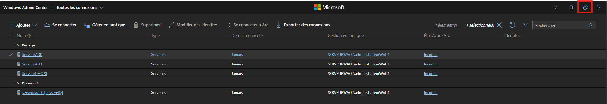
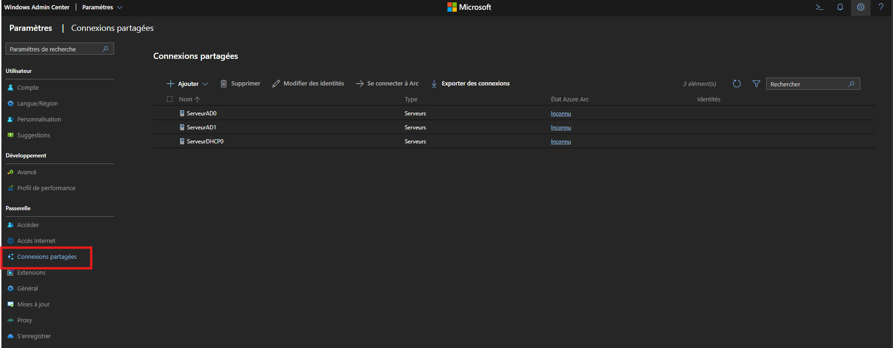
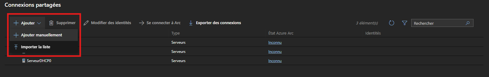
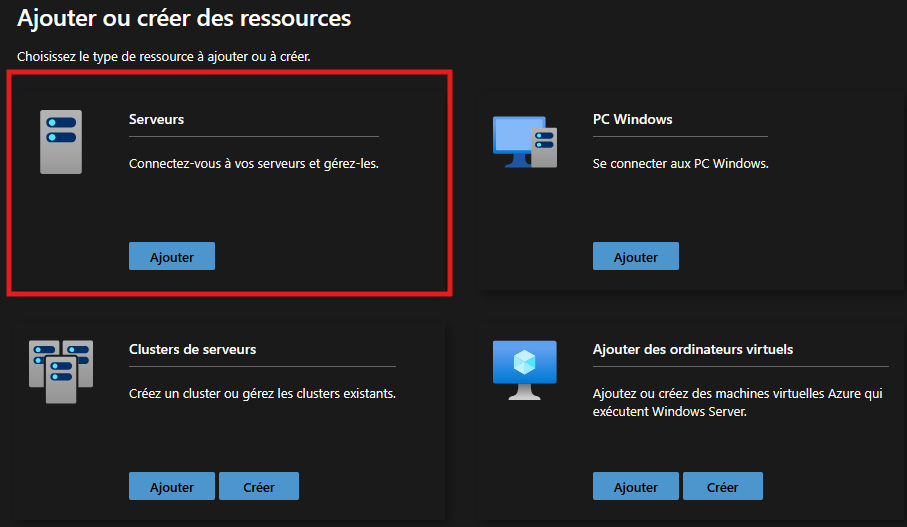
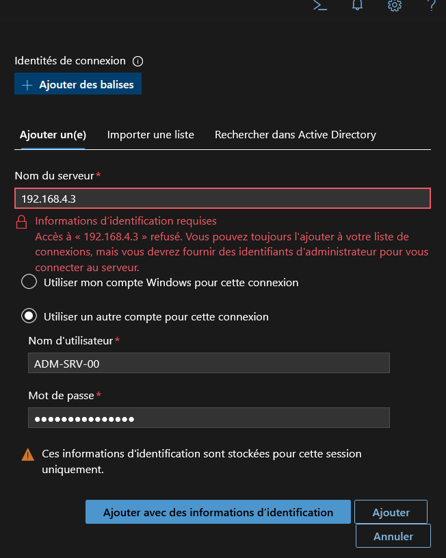

# Ajout d'un serveur dans WAC

---

## Informations

- **Auteur :** Louis MEDO
- **Date :** 16/09/2026
- **Domaine :** Windows

---

## 1. Sommaire

- [1. Sommaire](#1-sommaire)
- [2. Contexte](#2-contexte)
- [3. Ajout d'une machine sur WAC](#3-ajout-dune-machine-sur-wac)

## 2. Contexte

Cette procédure détaille l'intégration d'un nouveau serveur au sein de l'interface centralisée Windows Admin Center (WAC). Ce composant permet une gestion et une supervision à distance de l'infrastructure serveurs Windows, s'intégrant au réseau de gestion CUB tout en nécessitant des autorisations d'administration réseau spécifiques pour communiquer avec le parc de machines.

## 3. Ajout d'une machine sur WAC

3.1. **Accès au portail WAC et aux paramètres.** Accéder au site [wac0.local.dortmound.cub.sioplc.fr](https://wac0.local.dortmound.cub.sioplc.fr), puis aller dans les paramètres de WAC.

3.2. **Navigation vers les connexions.** Aller dans le menu `Passerelle`, puis sélectionner `Connexions partagées`.

3.3. **Ajout du serveur.** Cliquer sur `Ajouter` puis cliquer sur `Ajouter manuellement`.

3.4. **Sélection de la ressource.** Cliquer sur l'encart `Serveurs` dans la fenêtre listant les types de ressources.

3.5. **Configuration des identités de connexion.** Ajouter le nom du serveur et sélectionner `Utiliser un autre compte pour cette connexion` puis mettre les identifiants.

> [!warning] Sécurité et persistance des identifiants
> Conformément au message de l'interface, ces informations d'identification sont stockées pour cette session uniquement. 

- `192.168.4.3` : Adresse IP (ou nom d'hôte) identifiant le serveur cible à gérer sur le réseau.
- `Utiliser un autre compte pour cette connexion` : Option permettant de forcer l'authentification avec un compte de service dédié au lieu du compte de la session active.
- `ADM-SRV-00` : Identifiant du compte possédant les privilèges d'administration requis sur la machine cible.
