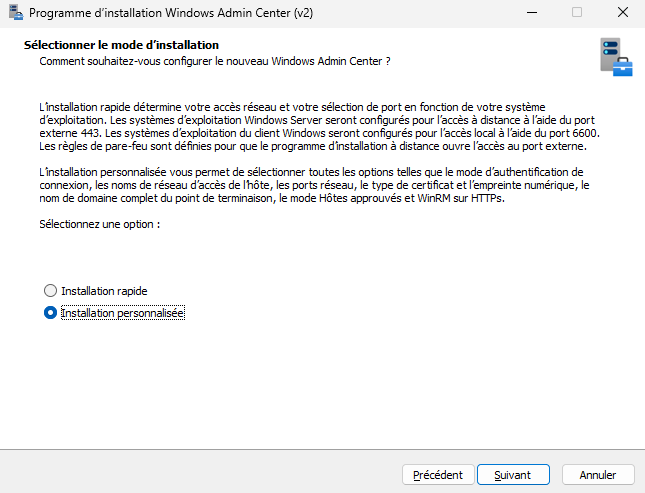
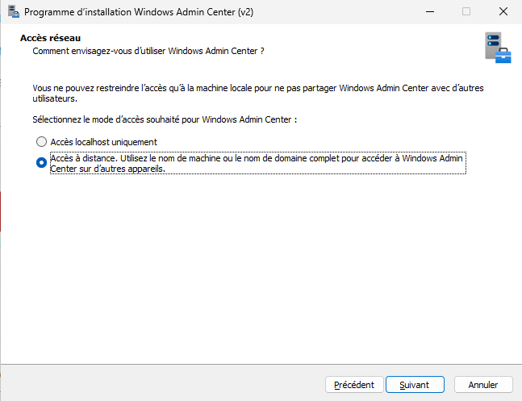
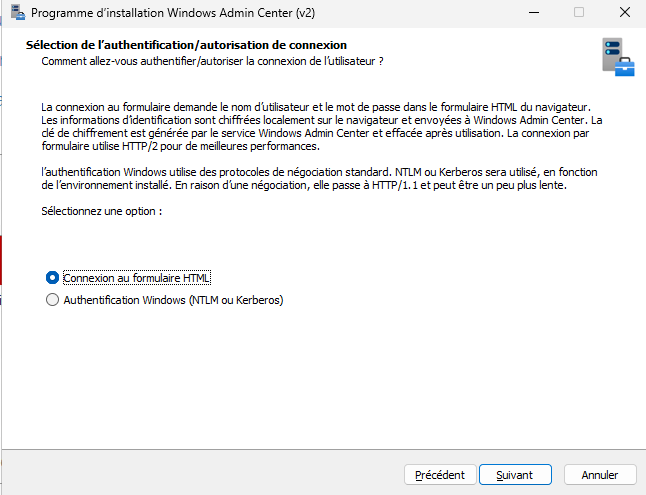
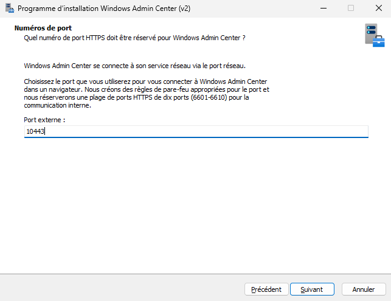
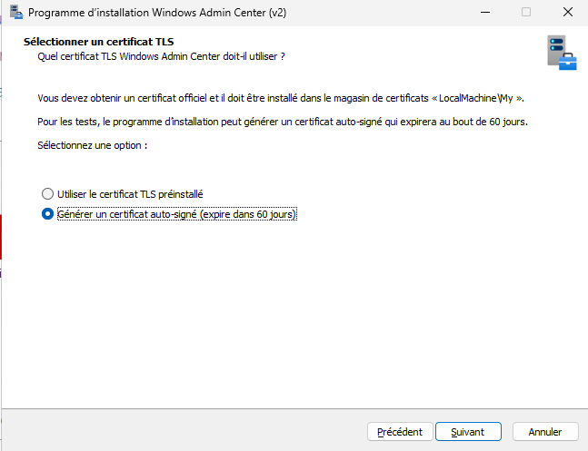
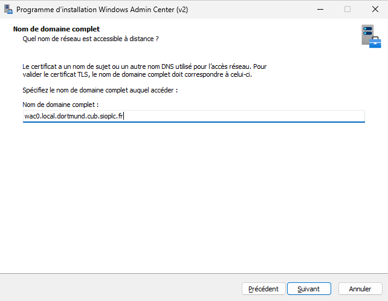
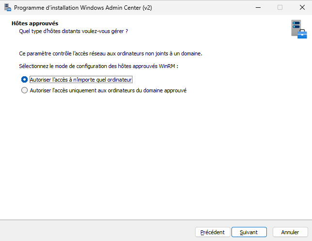
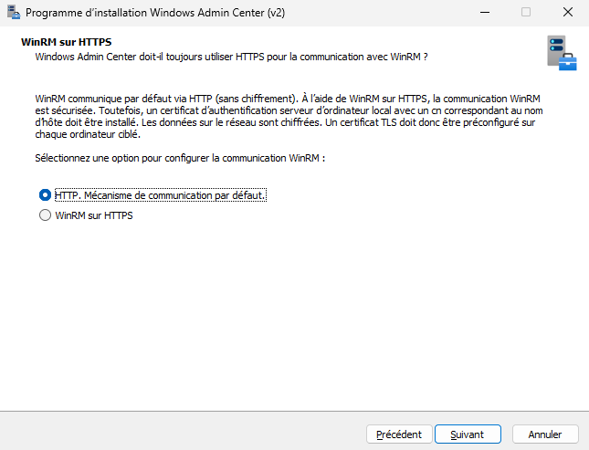
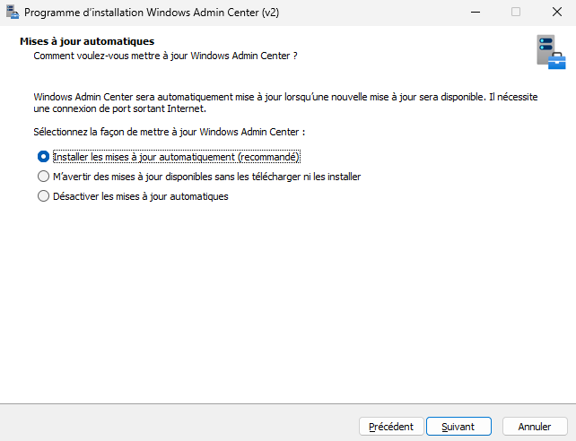

# Installation de WAC


---

## Informations

- **Auteur :** Louis MEDO
- **Date :** 16/09/2026
- **Domaine :** Windows

---

## 1. Sommaire

- [1. Sommaire](#1-sommaire)
- [2. Contexte](#2-contexte)
- [3. Installation](#3-installation)

## 2. Contexte

Déploiement de Windows Admin Center (WAC) pour l'administration centralisée de l'infrastructure CUB. L'installation est paramétrée en accès distant, avec un port personnalisé (10443) et une authentification hors domaine, en attente d'intégration complète à l'Active Directory et à la PKI.

## 3. Installation

3.1. **Lancement de l'installation.** Ouvrez un terminal en administrateur et entrez la commande ci-dessous.

```Powershell
winget install Microsoft.WindowsAdminCenter --interactive
```

- `winget install Microsoft.WindowsAdminCenter` : Télécharge et exécute le programme d'installation du paquet officiel depuis les dépôts Microsoft.
- `--interactive` : Force l'affichage de l'interface graphique (GUI) de l'installeur (MSI).

3.2. **Sélection du mode d'installation.** Sélectionner l'option **Installation personnalisée**.



3.3. **Configuration de l'accès réseau.** Cocher **Accès à distance** pour permettre l'administration depuis d'autres appareils via un nom de machine ou un FQDN.



3.4. **Choix de l'authentification.** Sélectionner **Connexion au formulaire HTML**.

> [!note] Information
> Cette méthode est choisie car le serveur n'est pas encore connecté au domaine Active Directory. L'authentification Windows classique (NTLM/Kerberos) n'est donc pas requise à ce stade.



3.5. **Configuration du port d'écoute.** Définir le **Port externe** sur **10443** (au lieu de 443).



3.6. **Création du certificat TLS.** Sélectionner **Générer un certificat auto-signé (expire dans 60 jours)**.

> [!warning] Attention
> Action temporaire requise car l'infrastructure ne dispose pas encore de PKI (Public Key Infrastructure) pour délivrer des certificats officiels.



3.7. **Définition du nom de domaine.** Renseigner le Nom de domaine complet (FQDN) cible : `wac0.local.dortmund.cub.siopic.fr`.



3.8. **Sécurisation des hôtes.** Choisir **Autoriser l'accès à n'importe quel ordinateur**.



3.9. **Configuration WinRM.** Conserver le mécanisme de communication par défaut : **HTTP**.



3.10. **Télémétrie et Mises à jour.** Conserver les options **Installer les mises à jour automatiquement** et **Données requises pour le diagnostic**.



3.11. **Lancement du déploiement.** Vérifier le résumé des paramètres puis cliquer sur **Installer**.

**Exemple de contenu que vous devriez avoir :**

```Text
Sélectionner le mode d’installation
    Installation personnalisée

Sélection de l’authentification/autorisation de connexion
        Connexion au formulaire HTML

Accès réseau
        Accès à distance. Utilisez le nom de machine ou le nom de domaine complet pour accéder à Windows Admin Center sur d’autres appareils.

Numéros de port
        Port externe :      10443
        Début de la plage de ports internes (inclus) :      6601
        Fin de la plage de ports internes (exclusif) :      6610

Sélectionner un certificat TLS
        Générer un certificat auto-signé (expire dans 60 jours)

Nom de domaine complet
        wac0.local.dortmund.cub.sioplc.fr

Hôtes approuvés
        Autoriser l’accès à n’importe quel ordinateur

WinRM sur HTTPS
        HTTP. Mécanisme de communication par défaut.

Mises à jour automatiques
        Installer les mises à jour automatiquement (recommandé)

Envoyer des données de diagnostic à Microsoft
        Données requises pour le diagnostic

Fichier journal
    C:\Users\ADMINI~1\AppData\Local\Temp\Setup Log 2026-09-16 #001.txt
```
